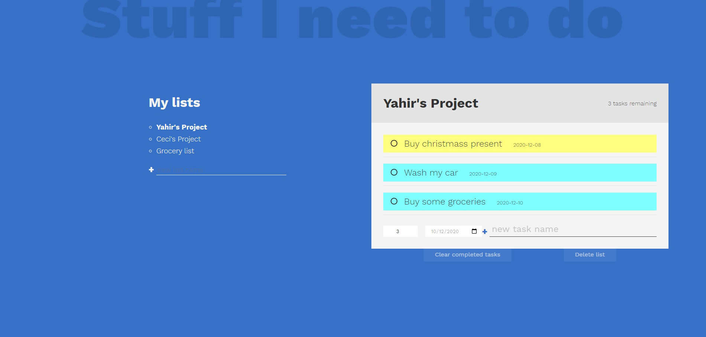

# To-Do List

#### Welcome to our To-Do List project. The purpose here is to create a to-do app.

#### Features
- Create a project with tasks.
- Delete and check completed tasks.
- Delete a project.
- Task can have a priority and dueDate.
- Switch between selected projects.

#### Screenshot

#### Livedemo
- [github-pages](https://ceci007.github.io/to-do-list/)

## Getting started
- run `git clone https://github.com/Ceci007/to-do-list.git`.
- run `npm install`, and then run `npm run build`.
- open `dist/index.html` with you favorite browser.

## Authors
👤 This is us:

- [Yahir Cardona](https://yahir91.github.io/yahir-cardona.github.io/)
- [Cecilia Benitez](https://github.com/Ceci007)

## Contributing

Contributions, issues and feature requests are welcome!

Feel free to check the [issues page](https://github.com/Ceci007/to-do-list/issues)

## Show your support

Give a star if you like this project!

## 📝 License

This project is MIT licensed.
